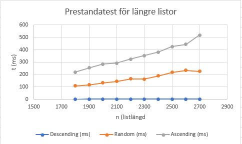

# Veckouppgift 3 Prestanda

### Prestandatest: insertion sort
Här visas resultatet av insertion sort med olika listtyper. 

Funktionen har tidskomplexitet **O(n²)**. Diagrammet visar att Descending är det mest effektiva fallet (Best Case) i denna implementation, eftersom sökningen avbryts direkt vid index 0. Ascending är funktionens "Worst Case", då varje nytt element tvingar loopen att söka igenom hela den hittills sorterade listan.