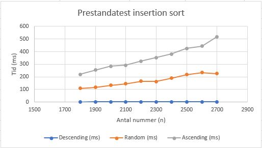
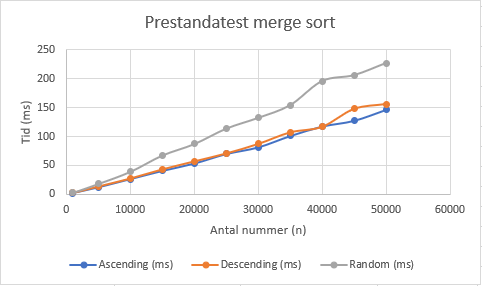

# Veckouppgift 3 Prestanda

### 2 Prestandatest: insertion sort
Här visas resultatet av insertion sort med olika listtyper. 

Funktionen har tidskomplexitet **O(n²)**. Diagrammet visar att Descending är det mest effektiva fallet (Best Case) i denna implementation, eftersom sökningen avbryts direkt vid index 0. Ascending är funktionens "Worst Case", då varje nytt element tvingar loopen att söka igenom hela den hittills sorterade listan.

 

### 3 Prestandatest: merge sort
Här visas resultatet av merge sort med olika listtyper. 

Funktionen har tidskomplexitet **O(n log n)**. Till skillnad från insertion sort är merge sort en "divide and conquer"-algoritm som delar upp listan oavsett hur den är sorterad från början. Diagrammet visar att Ascending och Descending presterar nästan identiskt, medan Random tar något längre tid på grund av fler nödvändiga jämförelser och minnesoperationer. Algoritmen uppvisar en mycket god skalbarhet då kurvorna växer betydligt långsammare än vid kvadratisk tidskomplexitet.

